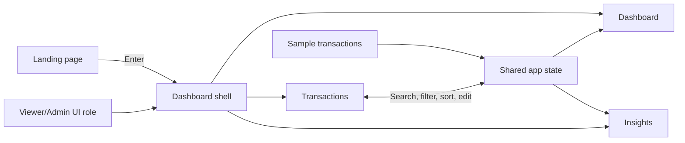

# FinanceIQ

FinanceIQ is a single-page personal finance dashboard for exploring income and expenses in Indian rupees (₹). It starts with sample data and provides a dashboard, transaction manager, and visual spending insights.

> **Demo app:** This project has no backend, account system, or database. Transactions you add, edit, or delete are held in browser memory and return to the sample data after a page reload. The Viewer/Admin switch is a UI demonstration, not an authentication or security boundary.

## At a glance



The app is built with React 18 and Vite. Recharts renders the charts, while shared React context keeps transactions, filters, the active page, and the selected UI role available across the dashboard.

## What you can do

| Area | What it shows or does |
| --- | --- |
| **Dashboard** | Total income, total expenses, net balance, a monthly balance trend, spending by category, and the five most recent transactions. |
| **Transactions** | Search descriptions and categories; filter by income/expense, category, or month; sort by date, description, or amount. |
| **Insights** | Highest-spend category, overall savings rate, month-over-month expenses, estimated average daily spend, and monthly income-versus-expense charts. |
| **Admin role** | Shows controls to add, edit, and delete transactions. |
| **Viewer role** | Hides transaction editing controls for a read-only presentation of the data. |

The supplied sample contains **38 transactions** across **January–March 2026** and uses ten categories: Food & Dining, Transport, Shopping, Entertainment, Healthcare, Utilities, Salary, Freelance, Investment, and Rent.

## Get started

### Requirements

- Node.js and npm

### Install and run locally

```sh
npm ci
npm run dev
```

Open the local URL printed by Vite in your terminal. Select **Let's Analyze** to enter the dashboard. Use the role selector at the bottom of the sidebar to try the Admin controls.

### Other commands

```sh
npm run build      # Create a production build in dist/
npm run preview    # Serve the production build locally
```

There is currently no test or lint command defined in `package.json`.

## Project map

```text
finance-dashboard/
├── index.html                    # HTML entry point and page title
├── package.json                  # Dependencies and npm scripts
├── vite.config.js                # Vite and React plugin configuration
├── eslint.config.js              # ESLint rules for JavaScript/JSX
├── vercel.json                   # SPA route rewrite for Vercel
├── public/
│   ├── favicon.svg               # Browser favicon
│   └── icons.svg                 # SVG symbol asset
└── src/
    ├── main.jsx                  # React root
    ├── App.jsx                   # Landing/dashboard switch and app shell
    ├── index.css                 # Theme, layout, and responsive styling
    ├── context/
    │   └── AppContext.jsx        # Shared app state and transaction actions
    ├── data/
    │   └── mockData.js           # Sample transactions and category colors
    └── components/
        ├── LandingPage.jsx       # Welcome screen
        ├── SideBar.jsx           # Navigation and UI role selector
        ├── Dashboard.jsx         # Dashboard composition and recent activity
        ├── SummaryCards.jsx      # Income, expense, and balance totals
        ├── BalanceTrend.jsx      # Monthly area chart
        ├── SpendingBreakdown.jsx # Expense category pie chart
        ├── Transactions.jsx      # Searchable, filterable transaction table
        ├── TransactionModal.jsx  # Add/edit transaction form
        └── Insights.jsx          # Financial metrics and comparison chart
```

## How the app is organized

1. `src/main.jsx` mounts `App`.
2. `src/App.jsx` shows the landing screen until the user enters. That choice is stored in `localStorage` as `showDashboard`; logging out clears it.
3. The dashboard pages are wrapped in `AppProvider` from `src/context/AppContext.jsx`. The provider starts with `mockTransactions` and exposes actions to add, edit, and delete entries.
4. `Transactions` updates the shared data and filters; the dashboard and insights recalculate their values from that data.
5. Components use shared category names and colors from `src/data/mockData.js`, and the common dark theme and responsive layouts come from `src/index.css`.

## Data and date-range notes

- Sample transactions are defined in `src/data/mockData.js`; amounts are formatted as Indian rupees.
- Transaction changes exist only in React state. They are not saved to `localStorage` or a server, so refreshing restores the original sample set.
- The summary cards use all current transactions. The balance chart, month filter, and several insights are explicitly set up for January, February, and March 2026; update their month lists/calculations when extending the demo to other periods.
- The role selector is intended for demonstrating the interface. It does not protect data or replace server-side authorization.

## Deployment

The Vite production output is written to `dist/`. `vercel.json` rewrites incoming paths to `index.html`, allowing the client-side app to load from nested routes when deployed to Vercel.
